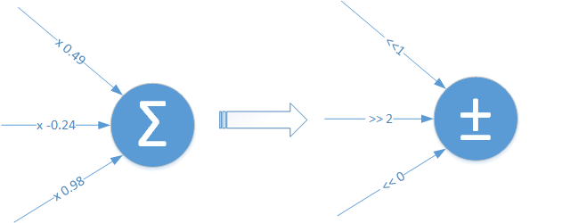
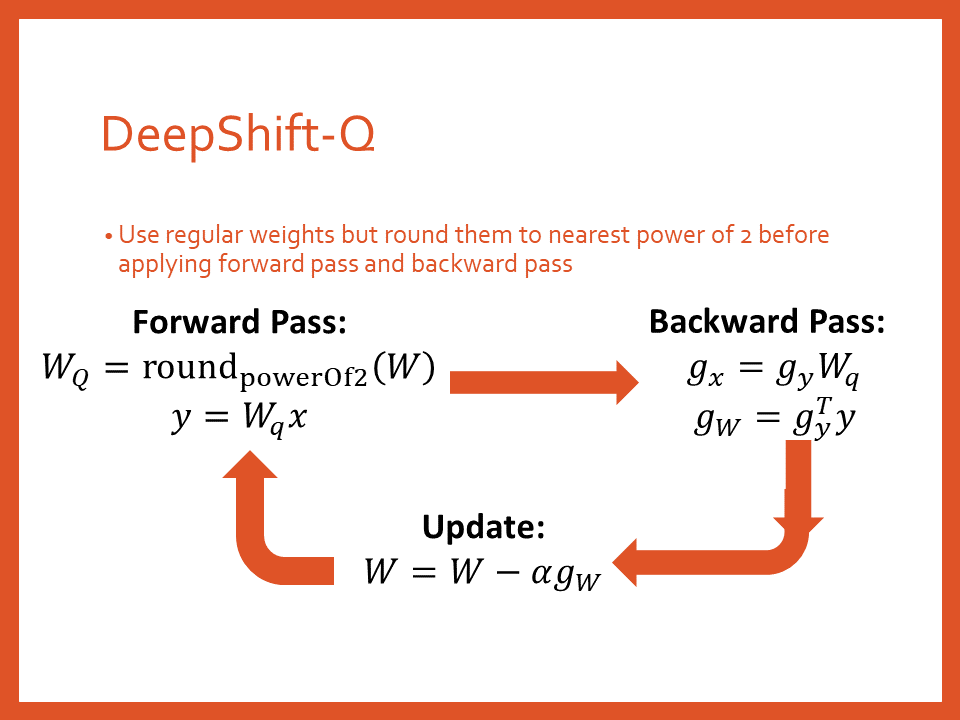
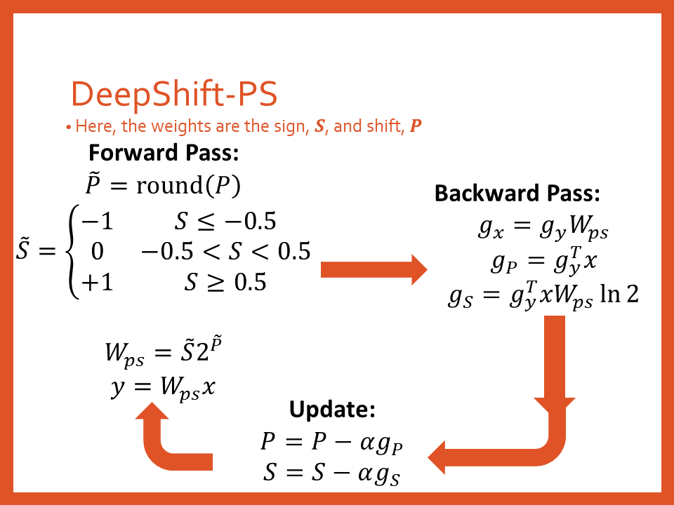

# DeepShift
This is project is the implementation of the [DeepShift: Towards Multiplication-Less Neural Networks](https://arxiv.org/abs/1905.13298) paper, that aims to replace multiplications in a neural networks with bitwise shift (and sign change).

This research project was done at Huawei Technologies.

##### Table of Contents  
  - [Overview](#overview)
  - [Important Notes](#important-notes)
  - [Getting Started](#getting-started)
  - [Running the Bitwise Shift CUDA & CPU Kernels](#running-the-bitwise-shift-cuda--cpu-kernels)
  - [Results](#results)
    - [MNIST](#mnist)
      - [Train from Scratch](#train-from-scratch)
      - [Train from Pre-Trained](#train-from-pre-trained)
    - [CIFAR10](#cifar10)
      - [Train from Scratch](#train-from-scratch-1)
      - [Train from Pre-Trained](#train-from-pre-trained-1)
      - [Using Fewer Bits](#using-fewer-bits)
    - [ImageNet](#imagenet)
      - [Train from Scratch](#train-from-scratch-2)
      - [Train from Pre-Trained](#train-from-pre-trained-2)
      - [Using Fewer Bits](#using-fewer-bits-1)
    - [Binary Files of Trained Models](#binary-files-of-trained-models)
  - [Code WalkThrough](#code-walkthrough)
 

## Overview
The main idea of DeepShift is to test the ability to train and infer using bitwise shifts.


We present 2 approaches: 
- DeepShift-Q: the parameters are floating point weights just like regular networks, but the weights are rounded to powers of 2 during the forward and backward passes
- DeepShift-PS: the parameters are signs and shift values



## Important Notes
- To train from scratch, the learning rate `--lr` option should be set to 0.01. To train from pre-trained model, it should be set to 0.001 and `lr-step-size` should be set to 5
- To use DeepShift-PS, the `--optimizer` must be set to `radam` in order to obtain good results.

## Getting Started
1. Clone the repo:
```
git clone https://github.com/mostafaelhoushi/DeepShift.git
```
2. Change directory
```
cd DeepShift
```
3. Create virtual environment: 
```
virtualenv venv --prompt="(DeepShift) " --python=/usr/bin/python3.6
```
4. (Needs to be done every time you run code) Source the environment:
```
source venv/bin/activate
```
5. Install required packages and build the spfpm package for fixed point
```
pip install -r requirements.txt
```
6. cd into `pytorch` directroy:
```
cd pytorch
```
7. To list all the available options, you may run:
```
python <dataset>.py --help
```
where `<dataset>` can be either `mnist`, `cifar10`, `imagenet`. 

When you run any training or evaluation script, you will have the model binary file as well as the training log in `./models/<dataset>/<arch>/<shift-type><shift-depth><weight-bit-width><desc>` where:
- `<shift-type>` is either `shift_q` if you pass `--shift-type Q`, `shift_ps` if you pass `--shift-type PS`, or `shift_0` if you are running the default FP32 baseline
- `<shift-depth>` is the number of layers from the start of the model that have been converted to DeepShift. This is determined by the `shift-depth` argument
-   

8. Now you can run the different scripts with different options, e.g.,
    a) Train a DeepShift simple fully-connected model on the MNIST dataset, using the PS apprach:
    ```
    python mnist.py --shift-depth 3 --shift-type PS --optimizer radam
    ```
    b) Train a DeepShift simple convolutional model on the MNIST dataset, using the Q approach:
    ```
    python mnist.py --type conv --shift-depth 3 --shift-type Q 
    ```
    c) Train a DeepShift ResNet20 on the CIFAR10 dataset from scratch:
    ```
    python cifar10.py --arch resnet20 --pretrained False --shift-depth 1000 --shift-type Q 
    ```
    d) Train a DeepShift ResNet18 model on the Imagenet dataset using converted pretrained weights for 5 epochs with learning rate 0.001:
    ```
    python imagenet.py <path to imagenet dataset> --arch resnet18 --pretrained True --shift-depth 1000 --shift-type Q --epochs 5 --lr 0.001
    ```
    e) Train a DeepShift ResNet18 model on the Imagenet dataset from scratch with an initial learning rate of 0.01:
    ```
    python imagenet.py <path to imagenet dataset> --arch resnet18 --pretrained False --shift-depth 1000 --shift-type PS --optimizer radam --lr 0.01
    ```
    f) Train a DeepShift ResNet18 model on the CIFAR10 dataset from scratch with 8-bit fixed point activation (3-bits for integers and 5-bits for fractions):
    ```
    python cifar10.py --arch resnet18 --pretrained False --shift-depth 1000 --shift-type PS --optimizer radam --lr 0.01 -ab 3 5
    ```

## Running the Bitwise Shift CUDA & CPU Kernels
1. cd into `DeepShift/pytorch` directroy:
```
cd DeepShift/pytorch
```
2. Run the installation script to install our CPU and CUDA kernels that perform matrix multiplication and convolution using bit-wise shifts:
```
sh install_kernels.sh
```
3. Now you can run a model with acutal bit-wise shift kernels in CUDA using the `--use-kernel True` option. Remember that the kernel only works for inference not training, so you need to add the `-e` option as well:
```
python imagenet.py --arch resnet18 -e --shift-depth 1000 --pretrained True --use-kernel True
```
4. To compare the latency with a naive regular convolution kernel that does not include cuDNN's other optimizations:
```
python imagenet.py --arch resnet18 -e --pretrained True --use-kernel True
```

## Results
### MNIST

#### Train from Scratch

| Model | Original | DeepShift-Q | DeepShift-PS |
|-------| -------- | ----------- | ------------ |
| Simple FC Model | 96.92% [[1]](#f1) | 97.03% [[2]](#f2) | 98.26% [[3]](#f3) |
| Simple Conv Model | 98.75% [[4]](#f4) | 98.81% [[5]](#f5) | 99.12% [[6]](#f6) |

Commands to reproduce results:
1. <span id="f1"></span> `python mnist.py`
2. <span id="f2"></span> `python mnist.py --shift-depth 1000 --shift-type Q`
3. <span id="f3"></span> `python mnist.py --shift-depth 1000 --shift-type PS --opt radam`
4. <span id="f4"></span> `python mnist.py --type conv`
5. <span id="f5"></span> `python mnist.py --type conv --shift-depth 1000 --shift-type Q`
6. <span id="f6"></span> `python mnist.py --type conv --shift-depth 1000 --shift-type PS --opt radam`

#### Train from Pre-Trained

| Model | Original | DeepShift-Q | DeepShift-PS |
|-------| -------- | ----------- | ------------ |
| Simple FC Model | 96.92% | 97.85% [[7]](#f7) | 98.26% [[8]](#f8) |
| Simple Conv Model | 98.75% | 99.15% [[9]](#f9) | 99.16% [[10]](#f10) |

Commands to reproduce results (assumes you have run commands [[1]](#f1) and [[2]](#f2) in order to have the baseline pretrained weights):

7. <span id="f7"></span> `python mnist.py --weights ./models/mnist/simple_linear/shift_0/weights.pth --shift-depth 1000 --shift-type Q --desc from_pretrained`  
8. <span id="f8"></span> `python mnist.py --weights ./models/mnist/simple_linear/shift_0/weights.pth --shift-depth 1000 --shift-type PS --opt radam --desc from_pretrained`  
9. <span id="f9"></span> `python mnist.py --type conv --weights ./models/mnist/simple_conv/shift_0/weights.pth --shift-depth 1000 --shift-type Q --desc from_pretrained`  
10. <span id="f10"></span> `python mnist.py --type conv --weights ./models/mnist/simple_conv/shift_0/weights.pth --shift-depth 1000 --shift-type PS --opt radam --desc from_pretrained` 

### CIFAR10

#### Train from Scratch

| Model | Original [[11]](#f11) | DeepShift-Q [[12](#f12) | DeepShift-PS [[13]](#f13) |
|-------| -------- | ----------- | ------------ |
| resnet18 | 94.45% | 94.42% | 93.20% |
| mobilenetv2 | 93.57% | 93.63% | 92.64% |
| resnet20 | 91.79% | 89.85% | 88.84% |
| resnet32 | 92.39% | 91.13% | 89.97% |
| resnet44 | 92.84% | 91.29% | 90.92% |
| resnet56 | 93.46% | 91.52% | 91.11% |

Commands to reproduce results:

11.  <span id="f11"></span> `python cifar10.py --arch <Model>` 
12.  <span id="f12"></span> `python cifar10.py --arch <Model> --shift-depth 1000 --shift-type Q`
13.  <span id="f13"></span> `python cifar10.py --arch <Model> --shift-depth 1000 --shift-type PS --opt radam`

#### Train from Pre-Trained

| Model | Original | DeepShift-Q | DeepShift-PS |
|-------| -------- | ----------- | ------------ |
| ResNet18 | 94.45% | 94.25% | 94.12% |
| MobileNetv2 | 93.57% | 93.04% | 92.78% |

#### Using Fewer Bits

| Model | Type | Weight Bits | Train from Scratch | Train from Pre-Trained |
|-------| ---- | ----------- | ------------------ | ---------------------- |
| ResNet18 | Original | 32 | 94.45% | - |
| ResNet18 | DeepShift-PS | 5 | 93.20% | 94.12% |
| ResNet18 | DeepShift-PS | 4 | 94.12% | 94.13% |
| ResNet18 | DeepShift-PS | 3 | 92.85% | 91.16% |
| ResNet18 | DeepShift-PS | 2 | 92.80% | 90.68% |

### ImageNet
Accuracies shown are Top1 / Top5.

#### Train from Scratch

| Model | Original | DeepShift-Q | DeepShift-PS |
| ----- | -------- | ----------- | ------------ | 
| ResNet18 | 69.76% / 89.08% | 65.32% / 86.29% | 65.34% / 86.05% |
| ResNet50 | 76.13% / 92.86% | 70.70% / 90.20% | 71.90% / 90.20% |
| VGG16 |  71.59% / 90.38% | 70.87% / 90.09% | TBD |

#### Train from Pre-Trained

| Model | Original | DeepShift-Q | DeepShift-PS |
| ----- | -------- | ----------- | ------------ | 
| ResNet18 | 69.76% / 89.08% | 69.56% / 89.17% | 69.27% / 89.00% |
| ResNet50 | 76.13% / 92.86% | 76.33% / 93.05% | 75.93% / 92.90% |
| GoogleNet | 69.78% / 89.53% | 70.73% / 90.17% | 69.87% / 89.62% |
| VGG16 |  71.59% / 90.38% | 71.56% / 90.48% | 71.39% / 90.33% |
| AlexNet | 56.52% / 79.07% | 55.81% / 78.79% | 55.90% / 78.73% |
| DenseNet121 | 74.43% / 91.97% | 74.52% / 92.06% | TBD |

#### Using Fewer Bits

| Model | Type | Weight Bits | Train from Scratch | Train from Pre-Trained |
|-------| ---- | ----------- | ------------------ | ---------------------- |
| ResNet18 | Original | 32 | 69.76% / 89.08% | - |
| ResNet18 | DeepShift-Q | 5 | 65.34% / 86.05% | 69.56% / 89.17% |
| ResNet18 | DeepShift-PS | 5 | 65.34% / 86.05% | 69.27% / 89.00% |
| ResNet18 | DeepShift-Q | 4 | TBD | 69.56% / 89.14% |
| ResNet18 | DeepShift-PS | 4 | 67.07% / 87.36% | 69.02% / 88.73% |
| ResNet18 | DeepShift-PS | 3 | 63.11% / 84.45% | TBD |
| ResNet18 | DeepShift-PS | 2 | 60.80% / 83.01% | TBD |

### Binary Files of Trained Models
TBD

## Code WalkThrough
* `pytorch`: directory containing implementation, tests, and saved models using PyTorch
    * `deepshift`: directory containing the PyTorch models as well as the CUDA and CPU kernels of `LinearShift` and `Conv2dShift` ops
    * `unoptimized`: directory containing the PyTorch models as well as the CUDA and CPU kernels of the naive implementations of `Linear` and `Conv2d` ops
    * `mnist.py`: example script to train and infer on MNIST dataset using simple models in both their original forms and DeepShift version.
    * `cifar10.py`: example script to train and infer on CIFAR10 dataset using various models in both their original forms and DeepShift version.
    * `imagenet.py`: example script to train and infer on Imagenet dataset using various models in both their original forms and DeepShift version.
    * `optim`: directory containing definition of RAdam and Ranger optimizers. RAdam optimizer is crucial to get DeepShift-PS obtain the accuracies shown here
